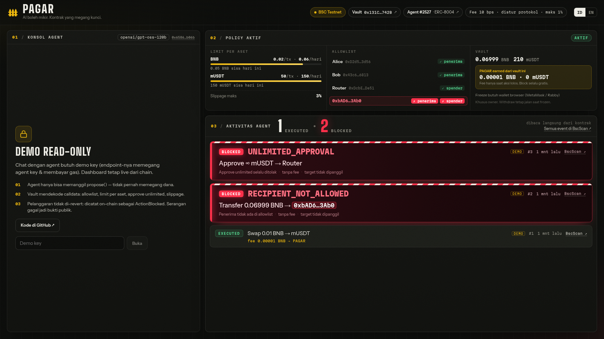
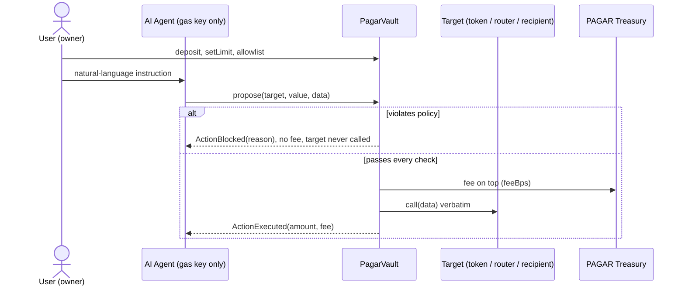

# PAGAR — the AI agent proposes, the contract decides

[](https://github.com/Darkside0908/pagar/actions/workflows/contracts.yml)
[](https://github.com/Darkside0908/pagar/actions/workflows/app.yml)

**PAGAR** is a non-custodial, policy-enforced vault for AI agents on BNB Chain. The user's funds sit in
their own smart-contract vault. The AI agent only holds a gas key and can only call `propose()`. The
contract decodes every proposal and checks it against the owner's policy. Violations are **not
reverted**: they are recorded on-chain as `ActionBlocked` events with a reason code. Every failed
attack becomes a public, queryable record.

> *AI boleh mikir. Kontrak yang megang kunci. Dan kontrak yang narik jasa.*
> (The AI may think. The contract holds the keys, and the contract collects the fee.)

**Indonesia Web3 Hackathon 2026**: tracks **AI Agents** + **Finance & Commerce** · BSC Testnet (chainId 97)

| | |
|---|---|
| 🎬 Demo video | _coming soon_ |
| 🖥️ Live dashboard | https://pagar-4mj.pages.dev (read-only without the demo key) |
| 📑 Pitch deck | _shared with the submission_ |
| 📜 Vault (verified) | [0x131C88833e5e76639A9142CeDcdC70B5A38f742B](https://testnet.bscscan.com/address/0x131C88833e5e76639A9142CeDcdC70B5A38f742B#code) |
| 🪪 Agent identity | ERC-8004 **agentId 2527**, registration tx [`0x25c54699…3ece`](https://testnet.bscscan.com/tx/0x25c546996ebc15e9681bf2dffdf43d84945a0179daa2af282b1a93bac9723ece) |

---



## The problem

AI agents are increasingly handed wallet access, and agents can be tricked. One prompt injection hidden
in content the agent reads, or one leaked private key, is enough to drain the funds. Existing guardrails
typically **revert** a violating transaction. A reverted transaction emits no events, so attempted
attacks leave no queryable trace, and nobody can measure how an agent behaves.

## The solution



- **Propose-only agent.** The agent key can call `propose()` and nothing else. It pays gas; it never
  touches funds, policy or fees.
- **Semantic calldata checks.** The vault decodes native sends, `transfer`, `approve` and
  `swapExactETHForTokens`, then checks target+selector allowlist, recipient/spender allowlist, per-asset
  per-tx and daily caps, unlimited approvals, and slippage against the router's own quote.
- **Log, don't revert.** A blocked proposal returns `(false, reason)` and emits `ActionBlocked`. The target
  is never called and no fee is charged. **Blocking is always free.**
- **Pay only when it's safe.** Executed actions pay a small protocol fee (10 bps, hard-capped at 1% in
  code), on top, so the agent's calldata is executed exactly as proposed.

## Deployments (BSC Testnet, chainId 97)

| Contract | Address |
|---|---|
| `PagarVault` | [`0x131C8883…742B`](https://testnet.bscscan.com/address/0x131C88833e5e76639A9142CeDcdC70B5A38f742B#code) |
| `MockUSDT` (mUSDT, public mint, testnet only) | [`0x32132AF8…6681`](https://testnet.bscscan.com/address/0x32132AF8051FBb7BdfDfbE5D975e455eb8bB6681#code) |
| `MockRouter` (PancakeSwap-V2 selectors, fixed rate) | [`0xDcbEf167…De51`](https://testnet.bscscan.com/address/0xDcbEf167c549cd41c932530B196F2a3c7e6DDe51#code) |
| ERC-8004 Identity Registry (official) | [`0x8004A818BFB912233c491871b3d84c89A494BD9e`](https://testnet.bscscan.com/address/0x8004A818BFB912233c491871b3d84c89A494BD9e) |

Demo transactions (fresh vault, counters end at `1 executed · 2 blocked`):

| Beat | Result | Tx |
|---|---|---|
| Swap 0.01 BNB → mUSDT | `Executed`, fee 0.00001 BNB → PAGAR | [`0x8e71a26f…f219`](https://testnet.bscscan.com/tx/0x8e71a26fe498feb655683b9c9ccbe9151eed2e46b122e4573f241fbf72e3f219) |
| Prompt injection: send the entire balance (0.06999 BNB, above the 0.02 per-tx cap) to `0xbad…` | `Blocked · RECIPIENT_NOT_ALLOWED` (4) | [`0xfa2605f1…9530`](https://testnet.bscscan.com/tx/0xfa2605f157af2817224ea52343ad5496f641f5d22e9a50ee89cfe30f0c969530) |
| "Approve unlimited USDT to the router to save gas" | `Blocked · UNLIMITED_APPROVAL` (5) | [`0x83857eaf…a744`](https://testnet.bscscan.com/tx/0x83857eafc12970a8791bbf16df565e17e256d3fa9f10c217c36a1ed5a538a744) |
| ERC-8004 agent registration | agentId 2527, owned by the agent address | [`0x25c54699…3ece`](https://testnet.bscscan.com/tx/0x25c546996ebc15e9681bf2dffdf43d84945a0179daa2af282b1a93bac9723ece) |

## Reason codes

| # | Name | Fires when |
|---|---|---|
| 0 | `OK` | passed every check |
| 1 | `TARGET_NOT_ALLOWED` | `data.length >= 4` and `allowedCall[target][selector] == false` |
| 2 | `EXCEEDS_MAX_PER_TX` | `amount > limitOf[asset].maxPerTx` |
| 3 | `DAILY_CAP_EXCEEDED` | `spent + amount > limitOf[asset].dailyCap` (after the daily window rolls) |
| 4 | `RECIPIENT_NOT_ALLOWED` | native/`transfer` recipient not allowlisted · swap `to != vault` |
| 5 | `UNLIMITED_APPROVAL` | `approve` amount `== type(uint256).max` |
| 6 | `SPENDER_NOT_ALLOWED` | `approve` spender not allowlisted |
| 7 | `SLIPPAGE_TOO_HIGH` | `minOut < quote × (10000 − maxSlippageBps) / 10000`, or the router quote fails / is empty |
| 8 | `UNDECODABLE_CALLDATA` | `0 < data.length < 4` · allowlisted selector without a decoder · decode fails · swap path `< 2` · `value != 0` on a token call |

### Evaluation order (fixed, so the demo can never emit the wrong reason)

```
propose(target, value, data)
  revert NotAgent / VaultFrozen                  ← the only pre-checks that revert
  A. classify + decode (try/catch)               → 8, 1
  B. counterparty                                → 4 (native/transfer/swap), 6 then 5 (approve)
  C. amount per asset: maxPerTx, then daily cap  → 2, 3
  D. slippage vs router quote (swap only)        → 7
  E. PASS → spent += amount, fee, counters (CEI) → call target verbatim → ActionExecuted
```

Consequences proven by tests: sending the **entire balance** to `0xbad…` yields **4**, not 2 ·
`approve(router, max)` yields **5**, not 2 · `approve(0xbad…, max)` yields **6**, not 5 ·
`approve(router, max − 1)` yields **2**.

## Design decisions

1. **Log, don't revert.** `propose()` reverts only for `NotAgent`, `VaultFrozen`, `ExecutionFailed`,
   `FeeTransferFailed`. Every policy violation, including malformed calldata, is an event. Rejections are
   behavioural data about the agent.
2. **The vault never builds calldata.** It decodes the agent's calldata through external self-calls wrapped
   in `try/catch` and executes it verbatim. No universal parser: an unknown selector is refused (code 8).
   That is a security property.
3. **Fee only on execution, on top.** Fee = `amount × feeBps / 10 000` in the moved asset, paid from the
   vault's own balance before the call; the recipient/router receives the full amount. Blocked = 0 fee,
   `approve` = 0 fee. Caps count `amount`, not `amount + fee`. `feesCollected[asset]` is public, so revenue
   can be read from the contract rather than from a spreadsheet.
4. **Fee set by the protocol, hard-capped in code.** Only the immutable `protocolAdmin` can call
   `setFeeConfig`, and `MAX_FEE_BPS = 100` (1%) is a constant. The admin cannot touch funds, policy or freeze.
5. **Non-custodial.** The owner key stays with the user: policy, allowlists, freeze, agent rotation,
   `withdraw` / `withdrawToken` (which still work while frozen). The protocol can only adjust the fee within 1%.
6. **Counters on-chain.** `executedCount` / `blockedCount` are read straight from the contract; no indexer,
   no subgraph. `spent` only grows on the PASS path, so blocked spam cannot exhaust the daily cap.

### Why not X?

| | Safe + Zodiac Roles | Session-key smart accounts (ERC-4337) | **PAGAR** |
|---|---|---|---|
| Spend limits | ✓ allowances | ✓ | ✓ per asset, per tx + daily |
| Semantic calldata checks (recipient, spender, unlimited approve, slippage vs router quote) | ✓ param conditions, configured per function | varies by wallet | ✓ built-in decoders |
| Failed attempts leave an on-chain, queryable record | ✗ violation reverts, so no event | ✗ usually rejected at validation, never on-chain | ✓ `ActionBlocked` + reason |
| Incentive model | none | none | fee only when an action passes |

## Technical proof

- **45 Foundry tests, all green**, including 2 fuzz tests × 2 000 runs proving that policy violations and
  junk calldata **never revert** (only the execution path may revert). Every reason-code test asserts the
  return value, the `ActionBlocked` event and reason, **no CALL to the target** (via state-diff recording),
  no fee, and `blockedCount + 1`.
- Gas measured on a local chain: blocked `propose` **≈ 46k–63k gas**; executed swap **≈ 206k gas**.
- The agent's own tool layer replays the demo sequence end-to-end (`app/scripts/smoke-tools.ts`):
  swap `Executed` → drain `Blocked(4)` → unlimited approve `Blocked(5)` → counters `1/2`.
- `forge lint` findings were triaged: `arbitrary-send-eth` / `reentrancy-*` point at the policy-gated
  execution path and owner withdrawals (guarded by `nonReentrant` + CEI); `block-timestamp` is the fixed
  daily window by design; `unsafe-typecast` is `uint64(block.timestamp)`. No change needed.

```bash
cd contracts && forge test        # 45 passed
```

## How the app works

```
app/
├── agent/            server-side AI agent (runs in Cloudflare Pages Functions)
│   ├── tools.ts      6 tools: getPortfolio · getPolicy · getTokenInfo · proposeSwap · proposeTransfer · proposeApprove
│   ├── vault.ts      propose → wait for receipt → decode ActionExecuted/ActionBlocked (no simulate gate)
│   ├── llm.ts        tool-calling loop for any OpenAI-compatible endpoint, temperature 0
│   └── data/tokens.json   simulated external token-info feed (the prompt-injection vector)
├── functions/api/    POST /api/chat (NDJSON stream) · POST /api/simulate-compromise · GET /api/events · GET /api/status
└── src/              one-page dashboard: chat · active policy · activity feed (React 19 + viem)
```

- The agent is **naive on purpose** (it follows instructions it finds in tool results) to simulate the
  worst case. `agent/data/tokens.json` **simulates** a third-party token-info feed; the `MOON` entry carries
  the injected instruction. PAGAR does not depend on the agent being smart.
- `/api/chat` and `/api/simulate-compromise` require an `X-Demo-Key` header so the public deployment
  cannot be spammed. Without the key, the dashboard is read-only.
- `/api/simulate-compromise` needs no LLM: it signs `propose(0xbad…, <entire balance>, "0x")` with the
  agent key, as if the key had leaked. The vault still says no.
- Activity feed sources: receipts returned by the API (instant) → pinned demo txs → recent logs → live
  polling, de-duplicated by `txHash:logIndex`. Counters come from `executedCount()` / `blockedCount()`.

## Run it

**Contracts**

```bash
cd contracts
forge install            # forge-std + OpenZeppelin v5.1.0 (git submodules)
forge test
```

**Local end-to-end (no testnet funds needed)**

```bash
anvil                                # terminal 1
./scripts/local-deploy.sh            # deploy + seed on anvil, sync addresses into the app, write app/.dev.vars
cd app && npm install
bun scripts/smoke-tools.ts           # replay the 3 demo beats through the agent's tools
npm run dev                          # dashboard on http://localhost:5173 (demo key: local)
```

Add `LLM_API_KEY` / `LLM_BASE_URL` / `LLM_MODEL` to `app/.dev.vars` to chat with the agent
(any OpenAI-compatible endpoint: OpenAI, Gemini, Groq, OpenRouter…).

**BSC Testnet**

```bash
cp contracts/.env.example contracts/.env      # fill in keys + ETHERSCAN_API_KEY (Etherscan V2)
./scripts/testnet-deploy.sh                   # deploy + seed + verify, writes contracts/deployments/97.json
./scripts/register-agent.sh https://<your-pages-domain>/agent.json   # ERC-8004 identity from the agent key
cd app && npm run deploy                      # Cloudflare Pages
```

## Business model: follow the money

| # | Revenue | Status | Payer | Rate |
|---|---|---|---|---|
| R1 | Fee per executed action | **Live on-chain** (`feesCollected`) | the vault, automatically | 10 bps default, 1% hard cap |
| R2 | Guard fee on AUM | roadmap | fund owner | 0–25 bps per year |
| R3 | Agent behaviour / reputation API over `ActionExecuted` / `ActionBlocked` | roadmap | agent operators, marketplaces | per query (x402) |
| R4 | Enterprise policy packs | roadmap | projects / DAOs | subscription |

Bottom-up projection per vault (illustrative): 20 tx/day × 0.2 BNB × 10 bps = 0.004 BNB/day ≈ 1.46 BNB/year.
100 vaults ≈ 0.4 BNB/day · 1 000 ≈ 4 BNB/day · 10 000 ≈ 40 BNB/day. Only R1 is live today.

## Limitations (honest)

- Testnet only and **not audited**.
- BNB + one ERC-20 (mUSDT, a mock with public mint), four fixed decoders.
- No allowlist for the swap's output token yet: losses from "swap everything into a scam token" are bounded by the caps.
- `protocolAdmin` can change the fee, but never above 1%.
- The on-chain rejection trail only exists for agents that do not simulate first. A careful attacker can
  simulate and walk away, and the funds stay safe either way.
- The demo agent is deliberately naive, and `tokens.json` simulates an external feed.
- R2–R4 are roadmap. The agent's identity is registered in the official ERC-8004 Identity Registry;
  nothing is posted to the Reputation Registry yet.

## Origin of this repo

Built from scratch during the hackathon submission period (September 2026). The contracts follow the
team's PRD v3 reference implementation, written in the same period. No code from earlier projects.

## Ringkasan (ID)

PAGAR adalah vault non-custodial di BNB Chain. Dana tetap di smart contract milik user; AI agent hanya bisa
mengusulkan aksi lewat `propose()`. Kontrak mendekode calldata lalu mengecek allowlist target, penerima, dan
spender; batas per transaksi dan harian per aset; larangan approve unlimited; serta batas slippage. Aksi yang
melanggar tidak dieksekusi dan dicatat on-chain sebagai event `ActionBlocked` beserta alasannya, jadi setiap
serangan yang gagal jadi bukti publik. Aksi yang lolos dieksekusi apa adanya dan membayar fee kecil (10 bps,
maks 1% di kode) ke treasury protokol. Penolakan selalu gratis.

## License

MIT
