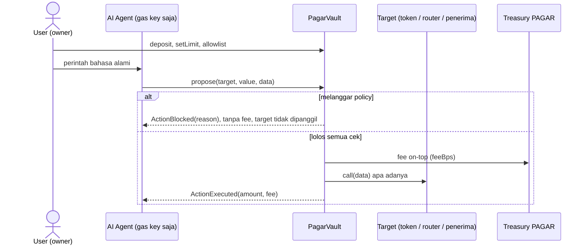

# Draft isi form submission — indonesiaweb3hack.xyz

> Salin per field. Bagian bertanda `TODO` diisi setelah deploy testnet / upload video.

## Nama tim & proyek

- **Project name:** PAGAR
- **Tagline:** AI boleh mikir. Kontrak yang megang kunci. Dan kontrak yang narik jasa.

## Track

**AI Agents** + **Finance & Commerce**

Kenapa dua track (kalau ada field alasan): track Finance & Commerce menyebut AI untuk
"mengotomatisasi, mengamankan, atau mengoptimalkan alur dana dan aset di blockchain". PAGAR
mengamankan alur dana. Track AI Agents menyebut agent yang "bertindak, mengambil keputusan, dan
berinteraksi secara mandiri di blockchain". PAGAR membuat otonomi itu aman.

## Alamat kontrak (BSC Testnet, chainId 97)

- PagarVault: `TODO` (verified di BscScan)
- MockUSDT: `TODO` · MockRouter: `TODO`

## Problem statement

AI agent makin sering diberi akses ke dompet, padahal agent bisa ditipu. Satu prompt injection dari
konten yang dibaca agent, atau satu private key yang bocor, cukup untuk menguras dana. Guardrail yang
ada umumnya me-revert transaksi yang melanggar, sehingga percobaan serangan tidak meninggalkan jejak
yang bisa diukur.

## Solution

PAGAR adalah vault non-custodial di BNB Chain. Dana tetap di smart contract milik user; AI agent hanya
bisa mengusulkan aksi lewat `propose()`. Kontrak mendekode calldata lalu mengecek allowlist target,
penerima, dan spender; batas per transaksi dan harian per aset; larangan approve unlimited; serta batas
slippage. Aksi yang melanggar tidak dieksekusi dan dicatat on-chain sebagai event `ActionBlocked`
beserta alasannya, jadi setiap serangan yang gagal jadi bukti publik. Aksi yang lolos dieksekusi apa
adanya dan membayar fee kecil (10 bps, maks 1% di kode) ke treasury protokol. Penolakan selalu gratis.

## Project detail (markdown + mermaid)

### Cara kerja

### Reason code (urutan evaluasi tetap)

| # | Reason | Kapan |
|---|---|---|
| 1 | `TARGET_NOT_ALLOWED` | kontrak + fungsi tidak di allowlist |
| 2 | `EXCEEDS_MAX_PER_TX` | nominal > batas per transaksi aset itu |
| 3 | `DAILY_CAP_EXCEEDED` | melewati batas harian aset itu |
| 4 | `RECIPIENT_NOT_ALLOWED` | penerima tidak di allowlist · output swap bukan ke vault |
| 5 | `UNLIMITED_APPROVAL` | approve `type(uint256).max` |
| 6 | `SPENDER_NOT_ALLOWED` | spender approve tidak di allowlist |
| 7 | `SLIPPAGE_TOO_HIGH` | `minOut` di bawah quote router dikurangi slippage maks |
| 8 | `UNDECODABLE_CALLDATA` | calldata tidak bisa didekode (ditolak, bukan revert) |

Urutan: decode (8, 1) → counterparty (4, 6, 5) → nominal (2, 3) → slippage (7) → eksekusi.
Konsekuensinya teruji: kirim seluruh saldo ke `0xbad…` keluar **4**, approve unlimited ke router keluar **5**.

### Keputusan desain

- **Log, bukan revert.** Pelanggaran policy tidak pernah revert: emit `ActionBlocked`, return `(false, reason)`.
  Transaksi revert tidak memancarkan event, jadi guardrail lain tidak meninggalkan jejak.
- **Vault tidak pernah membangun calldata sendiri.** Calldata agent didekode lewat try/catch lalu dieksekusi verbatim.
- **Fee hanya saat eksekusi, on-top.** Blocked = 0 fee, approve = 0 fee. `feesCollected[asset]` publik.
- **Fee diatur protokol, batas keras 1% di kode.** Owner tidak bisa mengubah fee; protocolAdmin tidak bisa menyentuh dana/policy.
- **Non-custodial.** Owner key di user; withdraw tetap jalan saat vault di-freeze.

### Bukti teknis

- 45 test Foundry lolos, termasuk 2 fuzz test × 2.000 run (pelanggaran & calldata sampah tidak pernah revert). CI GitHub Actions hijau.
- Gas: `propose` yang di-block ≈ 46–63 ribu gas; swap yang dieksekusi ≈ 206 ribu gas.
- Agent: 6 tool (getPortfolio, getPolicy, getTokenInfo, proposeSwap, proposeTransfer, proposeApprove), tool calling
  OpenAI-compatible, `propose` langsung tanpa simulate supaya proposal yang di-block tetap mendarat on-chain.
- Identitas agent terdaftar di Identity Registry ERC-8004 resmi: agentId `TODO` (tx `TODO`).

### Transaksi demo

| Beat | Hasil | Tx |
|---|---|---|
| Swap 0.05 BNB → mUSDT | Executed, fee 0.00005 BNB | `TODO` |
| Injeksi via data token: kirim seluruh saldo ke `0xbad…` | Blocked · RECIPIENT_NOT_ALLOWED | `TODO` |
| Approve unlimited USDT ke router | Blocked · UNLIMITED_APPROVAL | `TODO` |

### Keterbatasan

Testnet, belum diaudit · hanya BNB + satu ERC-20 (mock) · 4 decoder tetap · belum ada allowlist token output
swap · protocolAdmin bisa mengubah fee ≤ 1% · jejak penolakan hanya muncul dari agent yang tidak simulate dulu ·
agent demo sengaja naif dan `tokens.json` mensimulasikan feed eksternal · R2–R4 roadmap.

## Link

- Repo: https://github.com/Darkside0908/pagar
- Video demo (YouTube, ≤ 5 menit, public/unlisted): `TODO`
- Dashboard live: `TODO`
- Pitch deck: `TODO` (export PDF dari deck)
- Registrasi ERC-8004: `TODO`

## Anggota tim

- Muhammad Ghani Nurramdhan
- Gempar Cahyo Nugroho

## Checklist panitia

- [ ] Tim terdaftar di Luma
- [ ] Kontrak ter-deploy di BSC Testnet, alamat resolve di BscScan (verified)
- [ ] Pitch deck
- [ ] Repo GitHub publik
- [ ] Video demo YouTube ≤ 5 menit
- [ ] Edit code dari submit pertama disimpan di 2 tempat
